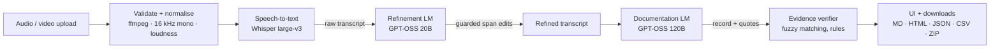

# MeetScribe — AI meeting assistant

Upload a meeting recording and get back, in one run:

1. a **raw transcript** (speech-to-text, timestamped),
2. a **refined transcript** where mis-heard technical terms, acronyms and jargon are corrected — with a word-level diff of every change,
3. a **meeting record**: summary, minutes by topic, key decisions, action items (owner / deadline only when the recording states them), and proposals that were discussed but not agreed.

Every decision and task carries a verbatim quote and timestamp from the recording, and a deterministic verifier removes anything the language model cannot back up with the transcript.



| Stage | Model (default) | Role |
|---|---|---|
| Speech-to-text | `whisper-large-v3` (Groq) — or local `faster-whisper` | Audio → timestamped segments |
| Transcript refinement | `openai/gpt-oss-20b` (Groq, low reasoning effort) | Domain profiling + minimal corrections of mis-recognised terms |
| Meeting documentation | `openai/gpt-oss-120b` (Groq, reasoning) | Summary, minutes, decisions, tasks, open items — with evidence quotes |

See [TECHNICAL.md](TECHNICAL.md) for the design write-up.

---

## Setup

Requirements: **Python 3.10+** and **ffmpeg** on your PATH.

```bash
# ffmpeg:  Ubuntu: sudo apt install ffmpeg   ·   macOS: brew install ffmpeg   ·   Windows: winget install ffmpeg
git clone <this-repo> meetscribe && cd meetscribe
python -m venv .venv && source .venv/bin/activate      # Windows: .venv\Scripts\activate
pip install -r requirements.txt
cp .env.example .env                                     # then paste your key into .env
```

One free Groq API key runs all three models: create it at <https://console.groq.com/keys> and set `GROQ_API_KEY` in `.env`.

## Run

**Web app**

```bash
python app.py                 # http://127.0.0.1:7860
python app.py --share         # temporary public link (for demos)
```

1. Upload a recording (mp3, wav, m4a, mp4, webm, ogg, flac, … — video files work too) or record from the microphone.
2. Optional: add **domain hints** (terms likely to be said, e.g. `Kubernetes, kubectl, OKR`). They are passed to Whisper as a spelling prompt and to the refinement model as a glossary.
3. Press **Process meeting**. The stage tracker shows progress; results appear as each stage finishes.
4. Inspect the tabs — Minutes, Decisions (with proposals that were *not* agreed), Action items, Transcripts (raw vs refined side by side), Corrections (diff + accepted/rejected edits), Checks (verification log) — and download the outputs.

**Command line**

```bash
python cli.py samples/demo_meeting.mp3 --hints "PgBouncer, Grafana, vLLM"
```

Each run writes a folder under `runs/`.

## Outputs

| File | Contents |
|---|---|
| `raw_transcript.txt` | Speech-to-text output with timestamps |
| `refined_transcript.txt` | Transcript after domain-term correction |
| `meeting_record.md` / `.html` | Human-readable record: summary, minutes, decisions, action items, open items, verification notes |
| `meeting_record.json` | Machine-readable record (same decisions and tasks as the Markdown/HTML — all are rendered from one object). Missing owners/deadlines are `"Unspecified"` with `owner_stated` / `deadline_stated` = `false` |
| `action_items.csv` | Tasks with owner, deadline, timestamp, evidence |
| `corrections.csv` | Every proposed transcript edit, whether it was applied, and why rejected ones were blocked |
| `transcripts.json` | Raw + refined segments with timestamps |
| `meeting_outputs.zip` | Everything above |

## Configuration

All settings live in `.env` (see `.env.example`). Every stage talks to an OpenAI-compatible API, so each one can be pointed at a different provider or model:

```bash
# e.g. documentation on OpenAI, refinement on a local Ollama model
DOCUMENT_BASE_URL=https://api.openai.com/v1
DOCUMENT_API_KEY=sk-...
DOCUMENT_MODEL=gpt-4.1
REFINE_BASE_URL=http://localhost:11434/v1
REFINE_API_KEY=ollama
REFINE_MODEL=qwen2.5:14b
```

Offline speech-to-text: `pip install faster-whisper` and set `STT_BACKEND=local` (`LOCAL_WHISPER_MODEL=large-v3` on a GPU, `small.en`/`medium.en` on CPU).

## Speed and rate limits

Free Groq plans limit tokens per minute per model, so a one-hour recording can take several minutes while the app waits on the
limit (the **Checks** tab shows how much of each run was waiting). Short meetings finish much faster, since the wait scales with transcript length. On a paid plan, add `LLM_CONCURRENCY=4` to `.env` for parallel requests. Finished runs can be reopened from
**Open a previous run** in the UI without calling any API, which is also a good fallback for demos.

## Error handling

The app reports a clear message (and never calls a paid API) for: unsupported file types, empty (0-byte) files, corrupted/undecodable files, files with no audio track, recordings that are too short, too long or too large, and silent recordings. If speech-to-text finds no speech, if an API key is missing or rejected, or a model name is wrong, the failing stage is marked in the tracker with an explanation. Rate limits are retried automatically (honouring `Retry-After`), and requests that exceed a provider's size limits are split automatically.

## Demo recording & evaluation

`samples/demo_meeting_script.txt` is a four-person engineering meeting full of jargon (Kafka, PgBouncer, kubectl, SOC 2, LoRA, vLLM, …) with decisions, a proposal that is deliberately *not* agreed, tasks with and without owners/deadlines. To synthesise it as audio (multi-voice, light office noise):

```bash
pip install edge-tts
python scripts/make_sample_meeting.py          # → samples/demo_meeting.mp3
python cli.py samples/demo_meeting.mp3
python scripts/evaluate.py runs/<run-folder>   # WER raw vs refined, term accuracy, decision/task/owner/deadline checks
```

`scripts/evaluate.py` works with any recording for which you have a script and an answer key in the same format.

### Results on the demo recording

`samples/demo_meeting.mp3` (2:56, 4 speakers), scored with `scripts/evaluate.py` against the hand-written answer key:

| Metric | Raw STT | Refined |
|---|---:|---:|
| Word error rate | 7.2% | 5.9% |
| Domain-term accuracy (15 terms) | 77% | 88% |

(Whisper's API is not fully deterministic, so re-running the same file gives slightly different numbers each time — typically 5–8% WER and 75–100% term accuracy on this recording. The decision/action-item results below are stable across runs.)

| Meeting-understanding metric | Result |
|---|---:|
| Decision recall | 1/1 (100%) |
| False decisions (proposals wrongly shown as decided) | 0 |
| Action-item recall | 3/4 (75%) |
| Owner accuracy | 2/4 (50%) |
| Deadline accuracy | 3/4 (75%) |

The one decision in the script (rolling out PgBouncer) was found with no false positives — the vLLM serving question, which was explicitly left undecided, correctly stayed an open item rather than becoming a decision.

The two misses, traced against the actual run output:

- **The 4th action item** — updating the idempotency key handling in the Razorpay webhook — was filed as an *open item* ("unresolved") instead of an action item. In the recording nobody is given it ("we'll leave the owner open for now and pick it up in planning"), and the documentation model read that as not-yet-committed work rather than as a real, currently-unowned task. This is the main thing worth tightening in `prompts/document.md`.
- **Owner accuracy** is held down by the same transcript: the script's second task ("I'll write the rollout runbook") has no speaker labels in the audio, so nothing in the words identifies *who* "I" is — Whisper and the documentation model have no way to know it was Meera. MeetScribe correctly leaves the owner **Unspecified** rather than guessing, which is the intended behaviour (see Limitations below), but it still scores as a miss against the answer key's "Meera". The other two owners (Rohan, Kabir) were both named explicitly in the audio and matched correctly.
- Separately, the refinement model once proposed a correction ("Mirrour" → "Mira") under the wrong segment number — the guard rejected it because that text isn't in the segment it cited (`corrections.csv`), which is the safety check working as designed rather than a bug: better to leave a mis-heard name alone than silently overwrite the wrong line.

## Tests

```bash
pytest -q
```

The test-suite runs offline: real ffmpeg processing of generated audio, with stand-in model APIs. It checks the full pipeline, the edit guards (numbers, negation and commitments cannot be changed), the evidence verifier (invented owners/deadlines/decisions are removed), consistency of the JSON and Markdown outputs, and every bad-input path.

## Project layout

```
app.py                 Gradio web interface
cli.py                 command-line runner
meetscribe/
  config.py            settings from .env
  audio.py             validation, normalisation, silence-aware chunking
  stt.py               stage 1 — Whisper (API or local), hallucination filtering
  refine.py            stage 2 — domain profile, guarded corrections, diff
  document.py          stage 3 — single-pass or map-reduce documentation
  grounding.py         evidence verifier for decisions / tasks / owners / deadlines
  render.py            Markdown, HTML, JSON, CSV, ZIP outputs
  pipeline.py          orchestration + progress reporting
  llm.py               OpenAI-compatible client: retries, JSON parsing, token-limit handling
  prompts/             model instructions (refinement + documentation)
scripts/               demo-audio generator, evaluator
samples/               demo script + answer key
tests/                 offline test-suite
```

## Limitations

- **No speaker diarization.** Whisper does not label speakers, so an owner is assigned only when the words name the person (e.g. "Rohan, please add the alert by Thursday" → "Yes, I'll do it"). "I'll do it" with no name nearby stays *Unspecified* — by design, rather than guessing.
- English recordings only (as specified). Heavy cross-talk or very noisy audio reduces transcription accuracy.
